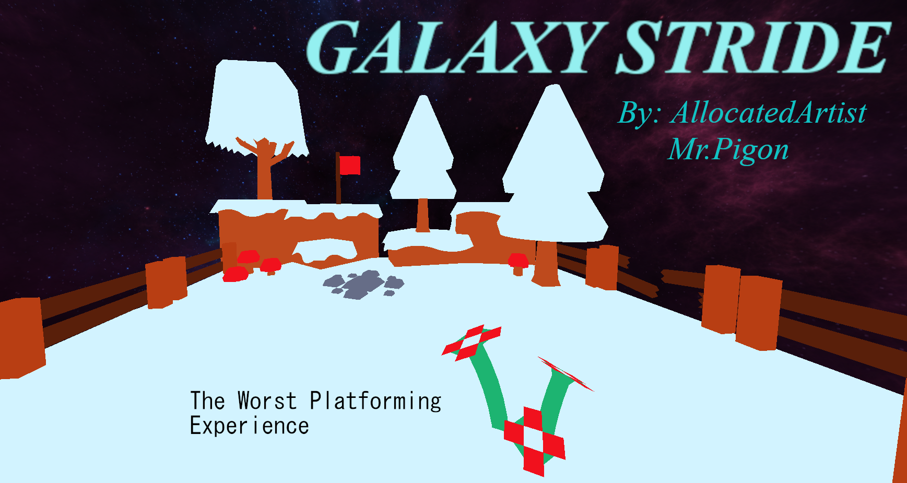
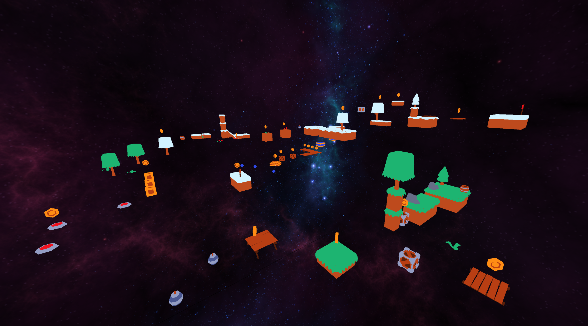

# Galaxy Stride -- *3D Platformer*

You can download the game on [Itch.io](https://allocatedartist.itch.io/galaxy-stride).

Galaxy Stride is a 3D platformer designed for peace and rage. 

There are two branches, *main* and *level_editor_working*. 

***[main]*** is the game as I've released it. It's main distinction from the other branch is that it uses *phys-fs* to load in assets from the .PAK file (this is just a .ZIP). Because of some changes I've had to make last minute, it is advised not to use the level editor in this branch because of how model loading and rendering has changed. 

***[level_editor_working]*** is an earlier commit before ***[main]***. The level editor in this branch is working as intended, but it should only be used for the level editor. It loads in assets from an uncompressed folder as opposed to the .PAK file.

The project has only been tested on Windows. I have no further plans to work on this project, but it has been an interesting experience. This is the 2nd time I have worked on a 3D game with a custom engine. 

Controls for Level Editor:
- WASD -- Move around
- Ctrl + Left Mouse -- Capture mouse
- Ctrl + Right Mouse -- Free mouse
- Tab -- Open Asset Bar
- Ctrl + F -- Flag Mode
- Ctrl + C -- Coin Mode
- Ctrl + S -- Save
- Ctrl + Z -- Remove the latest model (it removes the latest coin if you are in coin mode)
- F1 -- Play mode
- P -- Player mode (Sets player position)
- Q & E (Rotates player's view)
- 1 & 3 (Rotates model)
- E & R & T & Y (Changes placement mode for objects in this order [Follows mouse around, Locks to X-axis, Locks to Y-axis, Locks to Z-axis])
- Clicking on an object after it has been placed selects it.
- You can unselect by holding Ctrl and then clicking on the object again.
- After selecting an object, you can move it by dragging on one the 3 axes. This is very finnicky, and it is advised to use this only if you REALLY need to move an object.
- Dragging a json file with the appropriate level format into the editor loads it.
- If a json file has been loaded, then the level editor will save directly to that file.
- If you wish to save to a new file after loading in a pre-existing level, then press F3 to reset the current save file location.

3rd party Libraries used:
- **bullet3** (physics)
- **glad** (opengl loader)
- **nlohmann** (json)
- **physfs + raylib-physfs** (asset loading)
- **tinygltf** (custom model loader)
- **raylib** (os + game related functions)

3rd party assets are referenced on the itch page. 

